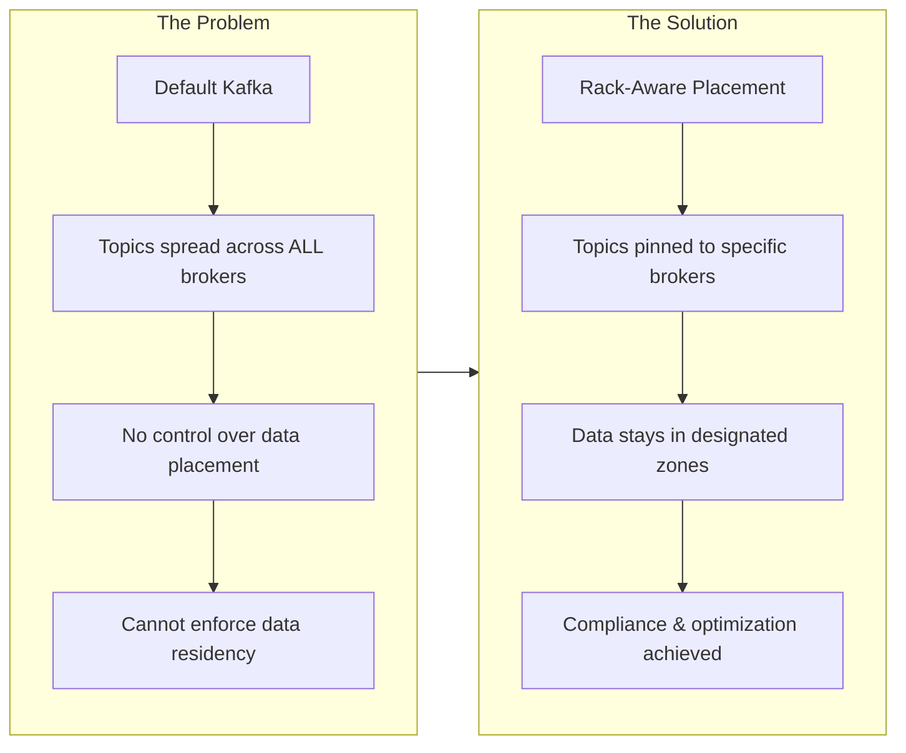
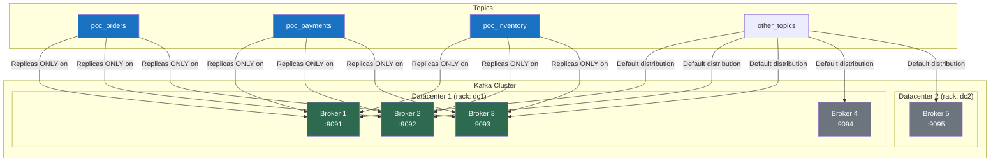
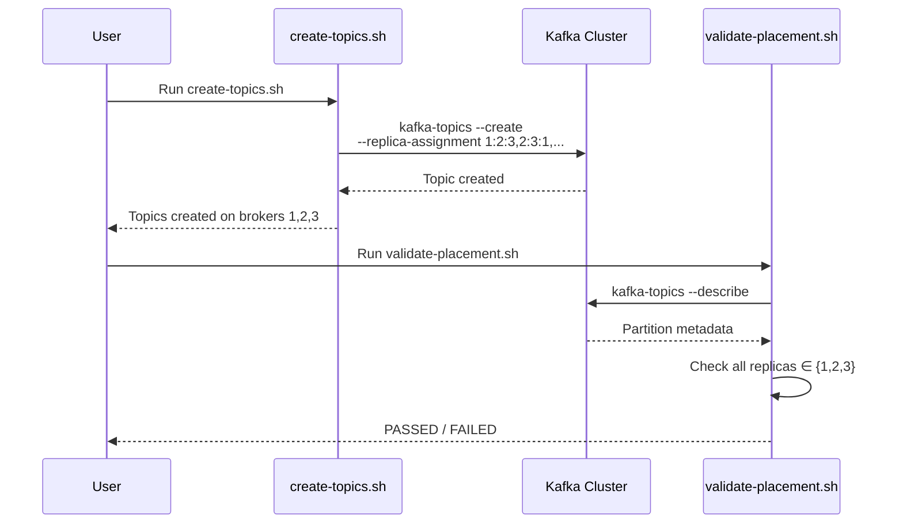

# Kafka Rack-Aware Topic Placement PoC

A proof-of-concept demonstrating Apache Kafka's rack-awareness capabilities for controlled topic placement across distributed infrastructure.

## TL;DR

This PoC proves you can **pin specific Kafka topics to specific brokers** while running a multi-datacenter cluster. Topics prefixed with `poc_` are guaranteed to have all replicas on brokers 1, 2, 3 only - never on brokers 4 or 5.

```bash
./scripts/startup.sh        # Start 5-broker cluster
./scripts/create-topics.sh  # Create constrained topics
./scripts/validate-placement.sh  # Verify placement rules
```

---

## What Problem Does This Solve?



**Real-world scenarios this enables:**

| Scenario | How This Helps |
|----------|----------------|
| **Data Residency** | Keep EU customer data on EU brokers only |
| **Cost Optimization** | Pin high-throughput topics to high-performance hardware |
| **Disaster Recovery** | Isolate critical topics to primary datacenter |
| **Compliance** | Prove data never leaves designated infrastructure |

---

## Architecture Overview



**Key Constraint:** All `poc_*` topics have replicas **exclusively** on brokers 1, 2, 3 (green). Brokers 4 and 5 (gray) never hold `poc_*` data.

---

## What This Proves

| Claim | Validation |
|-------|------------|
| Topics can be pinned to specific brokers | `poc_*` topics created with `--replica-assignment` specifying only brokers 1,2,3 |
| Placement is deterministic and reproducible | Same assignment string always produces same broker distribution |
| Validation can be automated | Shell and Python scripts verify no replicas exist on disallowed brokers |
| Constraint survives broker operations | Integration tests verify placement after broker failure/recovery |

### The Proof

```
$ ./scripts/validate-placement.sh

==========================================
 Validating poc_* Topic Placement
==========================================

Rule: All poc_* topics must have replicas only on brokers: 1 2 3

Checking topic: poc_orders
Checking topic: poc_payments
Checking topic: poc_inventory

==========================================
 Validation Results
==========================================

Topics checked:     3
Partitions checked: 18
Violations found:   0

PASSED: All poc_* topics have replicas only on brokers 1 2 3
```

---

## How It Works



**The magic is in the replica assignment string:**

```bash
--replica-assignment 1:2:3,2:3:1,3:1:2,1:2:3,2:3:1,3:1:2
                     ─────┬─────────────────────────────
                          │
         Partition 0: replicas on brokers 1, 2, 3
         Partition 1: replicas on brokers 2, 3, 1
         Partition 2: replicas on brokers 3, 1, 2
         ... (repeats for 6 partitions)
```

This explicitly tells Kafka exactly which brokers hold each partition's replicas, bypassing default round-robin distribution.

---

## Prerequisites

- Docker Desktop 4.x+ (with Docker Compose v2)
- 8GB RAM minimum available for Docker
- Ports 9091-9095 available

## Quick Start

```bash
# 1. Start the cluster
./scripts/startup.sh

# 2. Create sample topics
./scripts/create-topics.sh

# 3. Validate placement
./scripts/validate-placement.sh

# 4. Inspect cluster state
./scripts/inspect-cluster.sh

# 5. Stop the cluster
./scripts/teardown.sh
```

## Scripts

| Script | Description |
|--------|-------------|
| `scripts/startup.sh` | Start the 5-broker cluster and wait for health |
| `scripts/create-topics.sh` | Create `poc_orders`, `poc_payments`, `poc_inventory` topics |
| `scripts/validate-placement.sh` | Verify all `poc_*` topics use only brokers 1,2,3 |
| `scripts/inspect-cluster.sh` | Display cluster topology and topic distribution |
| `scripts/teardown.sh` | Stop the cluster (add `--clean` to remove volumes) |

## Python Validation Tool

For more detailed validation with formatted output:

```bash
# Install dependencies
pip install -r python/requirements.txt

# Run validation
python python/topic_validator.py

# Options
python python/topic_validator.py --help
python python/topic_validator.py --quiet           # Just pass/fail
python python/topic_validator.py --prefix "my_"    # Different prefix
python python/topic_validator.py --allowed-brokers "1,2"  # Different broker set
```

## Configuration

### Broker Rack Assignment

| Broker | Node ID | Rack | External Port |
|--------|---------|------|---------------|
| kafka-1 | 1 | dc1 | 9091 |
| kafka-2 | 2 | dc1 | 9092 |
| kafka-3 | 3 | dc1 | 9093 |
| kafka-4 | 4 | dc1 | 9094 |
| kafka-5 | 5 | dc2 | 9095 |

### Topic Placement

Topics with prefix `poc_` are created with manual replica assignment:

```bash
--replica-assignment 1:2:3,2:3:1,3:1:2,1:2:3,2:3:1,3:1:2
```

This ensures:
- 6 partitions per topic
- Replication factor of 3
- All replicas on brokers 1, 2, 3 only
- Leadership distributed evenly

## Connecting to the Cluster

```bash
# Bootstrap servers
localhost:9091,localhost:9092,localhost:9093,localhost:9094,localhost:9095

# Using kafka-console-producer
docker exec -it kafka-1 kafka-console-producer \
  --bootstrap-server kafka-1:29092 \
  --topic poc_orders

# Using kafka-console-consumer
docker exec -it kafka-1 kafka-console-consumer \
  --bootstrap-server kafka-1:29092 \
  --topic poc_orders \
  --from-beginning
```

## Troubleshooting

### Cluster won't start

```bash
# Check Docker resources
docker info | grep -E "CPUs|Memory"

# View broker logs
docker logs kafka-1
docker logs kafka-2
```

### Port conflicts

If ports 9091-9095 are in use, modify `docker-compose.yml` port mappings:

```yaml
ports:
  - "19091:9091"  # Change external port
```

### Validation fails

```bash
# Describe topics to see current assignment
docker exec kafka-1 kafka-topics \
  --bootstrap-server kafka-1:29092 \
  --describe \
  --topic poc_orders
```

### Reset cluster

```bash
./scripts/teardown.sh --clean
./scripts/startup.sh
```

## Technical Details

- **KRaft Mode**: No ZooKeeper dependency (Kafka 3.0+ native metadata management)
- **Combined Mode**: All brokers serve as both broker and controller
- **Manual Assignment**: Deterministic replica placement via `--replica-assignment`
- **Health Checks**: Built-in Docker health checks for startup verification

## CI/CD

This repository includes GitHub Actions workflows:

- **CI** (`ci.yml`): Linting (ShellCheck, Ruff) and Docker Compose validation
- **Integration Test** (`integration-test.yml`): Full cluster spin-up, topic creation, and validation

## License

MIT
