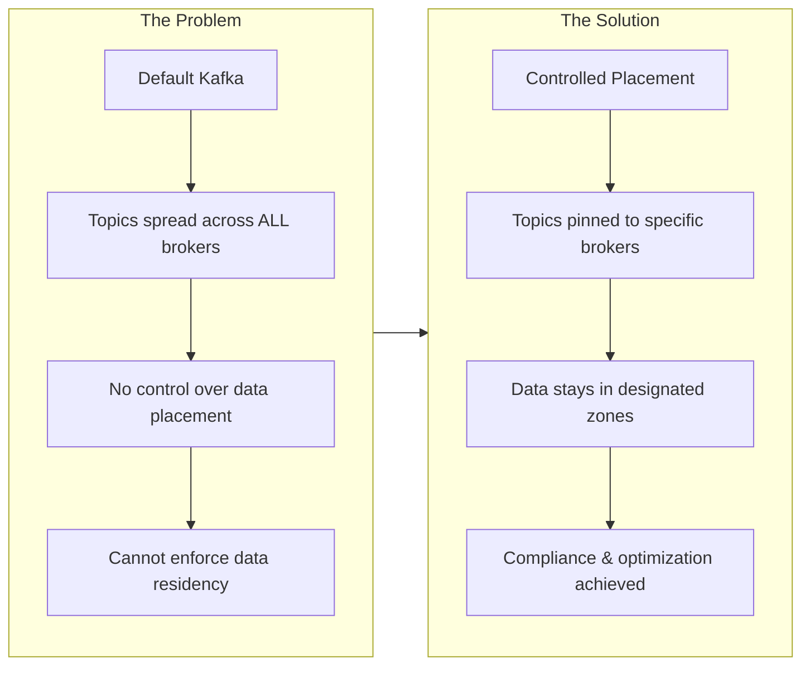

# Kafka Rack-Aware Topic Placement PoC

A proof-of-concept demonstrating Apache Kafka's rack-awareness capabilities for controlled topic placement across distributed infrastructure.

## TL;DR

This PoC proves you can **pin specific Kafka topics to specific brokers** while running a multi-datacenter cluster. Topics prefixed with `poc_` (Docker) or `poc-` (Strimzi) are guaranteed to have all replicas on designated brokers only.

**Choose your deployment method:**

| Example | Best For | Features |
|---------|----------|----------|
| [Docker Compose](./examples/docker-compose/) | Local development, quick testing | 5-broker KRaft cluster, manual replica assignment |
| [Minikube + Strimzi](./examples/minikube-strimzi/) | Production-like K8s environment | KafkaNodePools, 5 controllers + 5 brokers, Cruise Control |

---

## What Problem Does This Solve?



**Real-world scenarios this enables:**

| Scenario | How This Helps |
|----------|----------------|
| **Data Residency** | Keep EU customer data on EU brokers only |
| **Cost Optimization** | Pin high-throughput topics to high-performance hardware |
| **Disaster Recovery** | Isolate critical topics to primary datacenter |
| **Compliance** | Prove data never leaves designated infrastructure |

---

## Architecture Overview

### Broker Sets

Both examples use the concept of **broker sets** - logical groupings of brokers for topic placement:

| Broker Set | Purpose | Docker Compose | Strimzi |
|------------|---------|----------------|---------|
| `poc-brokers` | Topics with data residency requirements | Brokers 1, 2, 3 | Brokers 100, 101, 102 |
| `general-brokers` | General-purpose topics | Brokers 4, 5 | Brokers 200, 201 |

### Topic Placement Enforcement

Topics are placed on specific brokers using:
1. **Manual replica assignment** during topic creation (`--replica-assignment`)
2. **Cruise Control rebalancing** for ongoing enforcement (Strimzi only)

---

## Quick Start

### Option 1: Docker Compose (Local Development)

```bash
cd examples/docker-compose

# Start cluster (5 brokers in KRaft mode)
./scripts/startup.sh

# Create topics with controlled placement
./scripts/create-topics.sh

# Validate placement
./scripts/validate-placement.sh

# Inspect cluster state
./scripts/inspect-cluster.sh

# Cleanup
./scripts/teardown.sh
```

### Option 2: Minikube + Strimzi (Kubernetes)

```bash
# Start Minikube with sufficient resources
minikube start --cpus=4 --memory=8192

cd examples/minikube-strimzi

# Install Strimzi operator
./setup/install.sh

# Deploy Kafka cluster with NodePools
./scripts/deploy.sh

# Create topics with controlled placement
./scripts/create-topics.sh

# Validate placement
./scripts/validate-placement.sh

# Cleanup
./scripts/cleanup.sh
```

---

## Cruise Control Integration

The **Strimzi example** includes [Cruise Control](https://github.com/linkedin/cruise-control) for:

- **Cluster Monitoring**: Real-time metrics collection
- **Load Analysis**: CPU, disk, and network utilization per broker
- **Rebalance Proposals**: Suggestions for optimal partition placement
- **Automatic Enforcement**: Move misplaced topics to correct brokers

> **Note**: The Docker Compose example does not include Cruise Control as there is no official Docker image available. For Cruise Control functionality, use the Strimzi example.

### BrokerSetAwareGoal

Cruise Control 3.0.0+ includes the `BrokerSetAwareGoal` ([PR #1809](https://github.com/linkedin/cruise-control/pull/1809)) which automatically enforces topic placement within designated broker subsets.

---

## Validation

After creating topics, verify placement rules are enforced:

### Docker Compose

```
$ ./scripts/validate-placement.sh

==========================================
 Validating poc_* Topic Placement
==========================================

Rule: All poc_* topics must have replicas only on brokers: 1 2 3

Checking topic: poc_orders
Checking topic: poc_payments
Checking topic: poc_inventory

==========================================
 Validation Results
==========================================

Topics checked:     3
Partitions checked: 18
Violations found:   0

PASSED: All poc_* topics have replicas only on brokers 1 2 3
```

### Strimzi

```
$ ./scripts/validate-placement.sh

==========================================
 Validating Topic Placement (Strimzi)
==========================================

Rule: All poc-* topics must have replicas only on brokers: 100 101 102

Checking topic: poc-inventory
Checking topic: poc-orders
Checking topic: poc-payments

==========================================
 Validation Results
==========================================

Topics checked:     3
Partitions checked: 18
Violations found:   0

PASSED: All poc-* topics have replicas only on brokers 100 101 102
```

---

## Repository Structure

```
kafka-rack-aware-topic-placement/
├── README.md                     # This file
├── PLAN.md                       # Implementation plan
├── examples/
│   ├── docker-compose/           # Docker Compose example
│   │   ├── README.md
│   │   ├── docker-compose.yml
│   │   └── scripts/              # Startup, validation, teardown
│   │
│   └── minikube-strimzi/         # Strimzi on Kubernetes example
│       ├── README.md
│       ├── setup/                # Strimzi operator installation
│       ├── kafka/                # Kafka + KafkaNodePool CRs
│       ├── topics/               # KafkaTopic + KafkaRebalance CRs
│       └── scripts/              # Deploy, validate, cleanup
│
├── python/                       # Python validation tool
│   ├── topic_validator.py
│   └── requirements.txt
│
├── docs/                         # Additional documentation
│   ├── ARCHITECTURE.md
│   ├── OPERATIONS.md
│   ├── QUICK_START.md
│   ├── TEST_RESULTS.md           # Actual test output
│   └── TROUBLESHOOTING.md
│
└── .github/workflows/            # CI/CD pipelines
    ├── ci.yml
    └── integration-test.yml
```

---

## Python Validation Tool

For detailed validation with formatted output:

```bash
pip install -r python/requirements.txt

# Run validation against Docker Compose cluster
python python/topic_validator.py

# Options
python python/topic_validator.py --help
python python/topic_validator.py --quiet           # Just pass/fail
python python/topic_validator.py --prefix "my_"    # Different prefix
python python/topic_validator.py --allowed-brokers "1,2"  # Different broker set
```

---

## Technical Details

| Component | Docker Compose | Strimzi |
|-----------|---------------|---------|
| Kafka Version | 3.7.0 | 4.0.0 |
| Mode | KRaft (no ZooKeeper) | KRaft (no ZooKeeper) |
| Brokers | 5 (combined broker/controller) | 5 brokers + 5 controllers |
| Cruise Control | No | Yes (integrated) |
| Node Pool Support | N/A | Yes (KafkaNodePools) |

---

## Test Results

See [docs/TEST_RESULTS.md](./docs/TEST_RESULTS.md) for actual command outputs from testing both examples.

---

## References

- [Cruise Control BrokerSetAwareGoal PR #1809](https://github.com/linkedin/cruise-control/pull/1809)
- [Original Issue #1782](https://github.com/linkedin/cruise-control/issues/1782)
- [Strimzi KafkaNodePools Documentation](https://strimzi.io/docs/operators/latest/deploying#assembly-node-pools-str)
- [Strimzi Cruise Control Integration](https://strimzi.io/docs/operators/latest/deploying#cruise-control-concepts)
- [Strimzi Node ID Management Blog](https://strimzi.io/blog/2023/08/23/kafka-node-pools-node-id-management/)

---

## CI/CD

This repository includes GitHub Actions workflows:

- **CI** (`ci.yml`): Linting (ShellCheck, Ruff) and Docker Compose validation
- **Integration Test** (`integration-test.yml`): Full cluster spin-up, topic creation, and validation

---

## License

MIT
